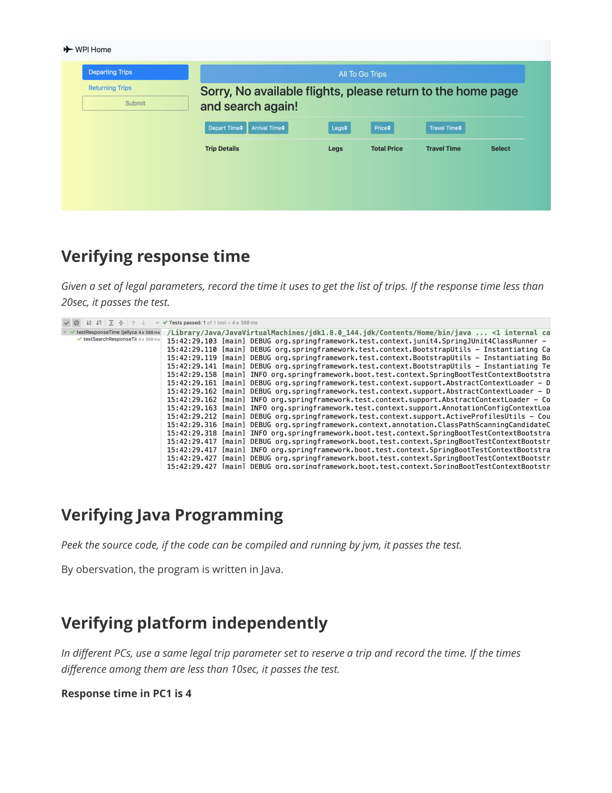

# Flight Reservation System
- Implemented a system to search, sort and retrieve flight data from web database server using Java. 
- Built the backend using Spring framework with RESTful API. Deployed and compiled with Maven.
- Designed an interactive frontend View with HTML, JavaScript, CSS. 
- Tested the code using JUnit. Achieved 100% function coverage and 90% code coverage.

## Verification can be found below

